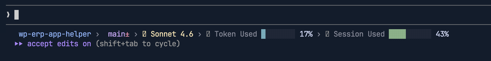

### Track Claude Usage in Claude Code (Realtime)

Use this setup to show token/session usage directly in your Claude Code status line.

1. Copy [`settings.json`](./settings.json) to:
   - `/Users/{your_mac_username}/.claude/settings.json`
   - Update the username in `settings.json` accordingly.
2. Copy [`statusline-command.sh`](./statusline-command.sh) to:
   - `/Users/{your_mac_username}/.claude/statusline-command.sh`
3. Make the script executable:
   - `chmod +x /Users/{your_mac_username}/.claude/statusline-command.sh`
4. Restart Claude Code (or open a new session).
5. Run:
   - `/statusline`

### Progress

- First progress bar showing % of used token on current context window.
- Second progress bar showing % of used session of current running slot.
